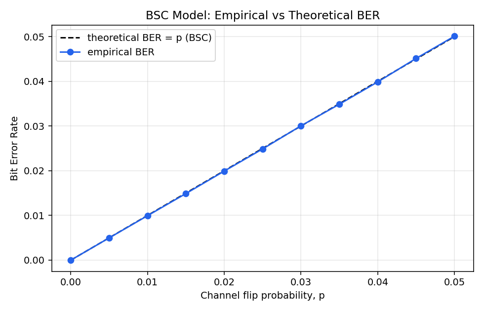
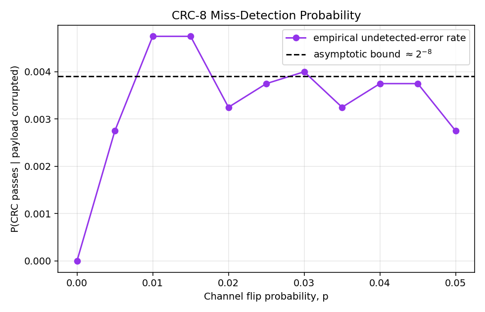
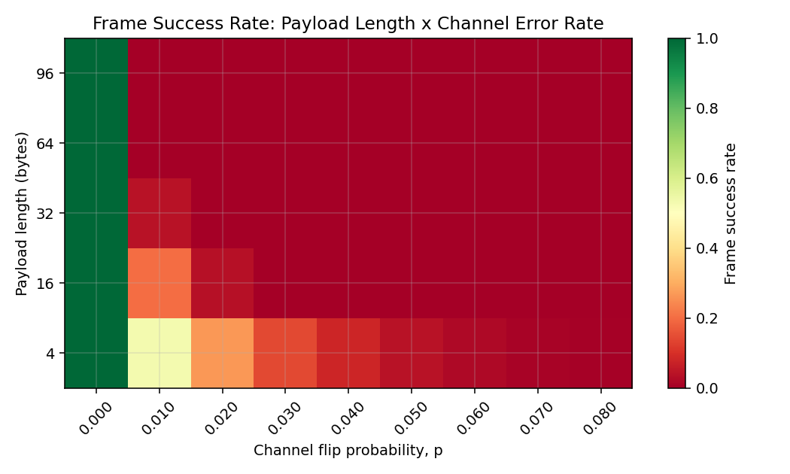

# Layered Link Simulator: From Raw Bits to Statistically Verified Frames

A small wireless link, built from the ground up: bit encoding, BPSK
modulation, a hand-rolled frame format, CRC-8 error detection, and two
channel noise models, checked against closed-form probability theory
using Monte Carlo simulation, not just eyeballed.

I built this in stages on purpose, each one runnable on its own before
moving to the next. See `docs/ROADMAP.md` for the full version history
and why the ordering matters.

## What this is actually showing

Three things a wireless/telecom systems role cares about:

- **Signal processing**: BPSK modulation over a Binary Symmetric Channel
  and a proper AWGN channel, with the AWGN bit error rate checked against
  the closed-form `Q(√(2·Eb/N0))` formula (`docs/THEORY.md`, section 1).
- **Protocol design**: a frame format I built myself, header, length,
  sequence number, payload, CRC-8, with real parsing and corruption
  handling, not a toy example (`docs/ARCHITECTURE.md`).
- **Performance analysis**: I derived frame error rate and CRC
  miss-detection probability by hand, then ran thousands of simulated
  trials to see if the numbers actually held up. They mostly did, and
  where they didn't line up exactly is discussed too (`docs/THEORY.md`).

## Quickstart

```bash
git clone <this-repo>
cd telecom-frame-sim
pip install -r requirements.txt

# run the test suite
pytest tests/ -v

# single frame, clean channel
python scripts/run_demo.py --payload "hello link layer"

# same frame, noisy BSC channel
python scripts/run_demo.py --payload "hello link layer" --channel flip --p-error 0.03

# same frame, AWGN channel at a given signal quality
python scripts/run_demo.py --payload "hello link layer" --channel awgn --eb-n0-db 4

# regenerate every figure and CSV from a fresh Monte Carlo run
python analysis/statistical_analysis.py
```

## Results

All figures below are generated directly by `analysis/statistical_analysis.py`,
seeded (`RNG_SEED = 42`) so the numbers are reproducible. Run the script
again and you get the same plots and the same CSVs in `results/`.

### BER tracks theory on both channel models

BSC, empirical BER vs. `p` (they sit right on top of each other, since the
flip channel *is* a BSC by construction):



AWGN, empirical vs. `Q(√(2·Eb/N0))`, log scale, the classic waterfall curve:


Both track theory closely enough that I trust the modem and channel code.
If there were a bug in the modulation or noise injection, this is exactly
where it would show up as a gap between the two curves.

### Frame error rate amplifies bit error rate, fast

A frame only survives if every single bit in it survives, so a small p
turns into a much bigger frame loss number. This is the plot that justifies
adding FEC in V0.4.


### CRC-8 catches almost everything, not everything

Roughly 1 in 256 corrupted frames should slip past the CRC check by pure
chance (`2^-8`). The empirical rate bounces around that line, which is
what you'd expect from a rare-event estimate over a few thousand trials.



### Frame success collapses as payload grows

Same channel quality, longer frame, worse odds. A direct, visual case for
keeping frames short or adding coding.



## Repository layout

```
src/                     core library: physical, link, and pipeline layers
  bitops.py              string <-> bit string <-> byte conversions
  modem.py                BPSK modulation, BSC/AWGN channels, closed-form BER
  crc.py                  CRC-8 compute/verify
  framing.py               frame build/parse: header, length, sequence, payload, CRC
  pipeline.py              wires transmit -> channel -> receive into one call
scripts/
  run_demo.py               interactive single-frame CLI demo
analysis/
  statistical_analysis.py Monte Carlo sweeps -> figures/ and results/
tests/                    pytest suite, one file per module (15 tests)
figures/                  generated plots (rebuilt by the analysis script)
results/                  generated CSVs (rebuilt by the analysis script)
docs/
  ARCHITECTURE.md          layer diagram, module responsibilities
  THEORY.md               the math behind every figure above
  ROADMAP.md               V0.1 through V1.0, and why the order makes sense
```

## Frame format

```
+----------+----------+------------+-------------------+---------+
| HEADER   | LENGTH   | SEQUENCE   | PAYLOAD (N*8 bits) | CRC-8   |
| 8 bits   | 8 bits   | 8 bits     | LENGTH*8 bits      | 8 bits  |
+----------+----------+------------+-------------------+---------+
```

CRC-8 (polynomial `0x07`) is computed over `HEADER || LENGTH || SEQUENCE ||
PAYLOAD`, exactly what's on the wire, nothing extra. Full layer breakdown
in [`docs/ARCHITECTURE.md`](docs/ARCHITECTURE.md).

## Testing

```bash
pytest tests/ -v
```

15 tests: bit-string round-tripping, CRC determinism and single-bit
sensitivity, frame build/parse round-trips and corruption detection,
modem/channel sanity checks (modulation inverts cleanly, a zero-probability
channel is a no-op, BER falls as signal quality rises).

## What's next

This is V0.3.5, the refactor-and-verify pass on top of V0.1 through V0.3.
Forward error correction, ARQ retransmission, burst-error channel models,
and basic multi-user access are next. Reasoning for the order is in
[`docs/ROADMAP.md`](docs/ROADMAP.md).

## License

MIT, see [`LICENSE`](LICENSE).
