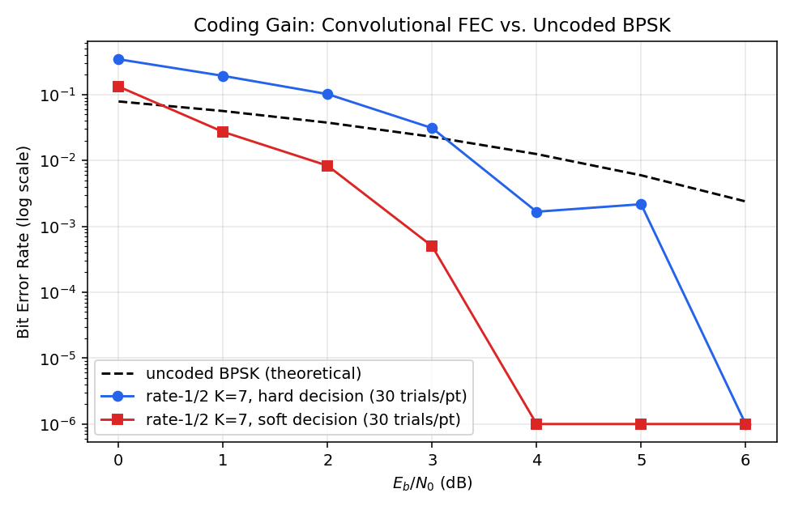
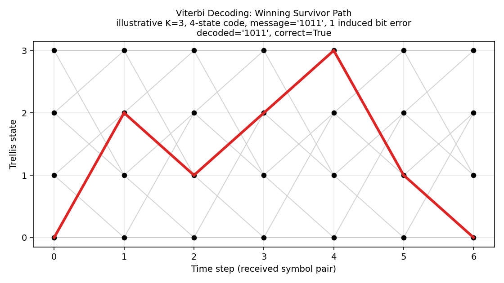
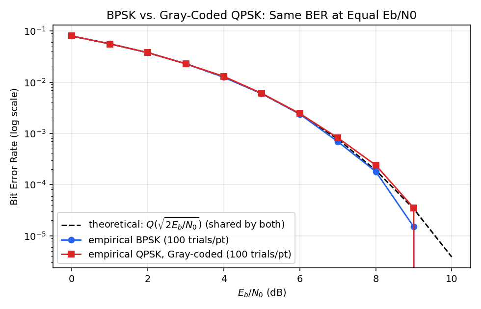

# Layered Link Simulator: From Raw Bits to a Verified, Coded Physical-Layer Waveform

A wireless link built bottom-up: bit encoding, custom framing with CRC
error detection, two channel noise models, BPSK and QPSK with
root-raised-cosine pulse shaping, and rate-1/2 K=7 convolutional coding
with Viterbi decoding. Every claim in this repo is backed by a Monte
Carlo measurement checked against closed-form probability theory, not
eyeballed, not assumed, and reported honestly where the two don't
perfectly agree.

Built in small versions that each work end-to-end before the next one
starts. Current stage: V0.6, convolutional FEC with
both hard- and soft-decision Viterbi decoding, coding gain measured
against the uncoded baseline. Next stage is the full simulated receiver
DSP chain, then hardware bring-up: an RTL-SDR receiving a conducted
waveform generated by a Raspberry Pi Pico 2, so everything this repo
predicts in software gets checked against a signal on an actual cable.

## Research approach

This isn't "write code, ship it." Every version follows the same loop:

1. **Derive the expected result by hand first** (`docs/THEORY.md`) —
   closed-form BER, frame error rate, CRC miss-detection probability,
   coding gain, all worked out analytically before any simulation runs.
2. **Measure it empirically** with a seeded Monte Carlo harness
   (`analysis/`), thousands of trials per data point, never fewer than
   30 trials per point and often 100+, with total simulated bits in the
   hundreds of thousands to millions depending on the sweep.
3. **Compare, and report the gap honestly.** Where simulation and theory
   diverge, that's investigated and explained, not hidden. Two examples
   already in this repo: a finite-tap RRC filter costing a small,
   explained amount of real SNR (section 5.3), and convolutional coding
   being *worse* than uncoded below its crossover SNR, a real, expected
   effect of rate loss, not a bug (section 7.4).
4. **Regression-test the theory check itself.** If a future change to
   the framing, modem, or FEC code introduces a bug, the empirical curve
   drifting off the theoretical one is the signal, the validation
   doubles as a test suite.

## What this demonstrates

- **Signal processing**: BPSK and Gray-coded QPSK over Binary Symmetric
  and AWGN channels, root-raised-cosine pulse shaping with a matched
  receive filter, and rate-1/2 K=7 convolutional coding with both
  hard- and soft-decision Viterbi decoding, coding gain measured, not
  asserted (`docs/THEORY.md`).
- **Protocol design**: a hand-built frame (header, length, sequence,
  payload, CRC) with real parsing and corruption handling
  (`docs/ARCHITECTURE.md`).
- **Performance analysis**: frame error rate, CRC miss-detection
  probability, BPSK/QPSK bit-error equivalence, and FEC coding gain, all
  derived analytically first, then checked against Monte Carlo data,
  with every meaningful discrepancy explained rather than smoothed over.

## Quickstart

```bash
git clone <this-repo>
cd telecom-frame-sim
pip install -r requirements.txt

pytest tests/ -v                                     # 49 tests

python scripts/run_demo.py --payload "hello link layer"
python scripts/run_demo.py --payload "hello link layer" --channel flip --p-error 0.03
python scripts/run_demo.py --payload "hello link layer" --channel awgn --eb-n0-db 4

python analysis/statistical_analysis.py               # framing/CRC/channel sweeps
python analysis/pulse_shaping_analysis.py              # RRC + matched-filter BER sweep
python analysis/qpsk_vs_bpsk_analysis.py               # BPSK vs QPSK BER + constellation
python analysis/fec_viterbi_demo.py                    # Viterbi trellis + coding gain sweep
```

## Results

Generated directly by the analysis scripts, seeded for reproducibility.
Full derivations, methodology, and raw numbers in `docs/THEORY.md`.

### Convolutional coding buys real margin, and the data shows where

Rate-1/2, K=7 (133, 171 octal) convolutional code, hard- and
soft-decision Viterbi decoding, 30 Monte Carlo trials per Eb/N0 point,
200 info bits per trial, measured against the closed-form uncoded curve:



At 3 dB, soft-decision decoding measures a **0.05% BER against an
uncoded 2.29%**, roughly a 45x reduction at the same signal energy. Below
about 2-3 dB the code is measurably *worse* than uncoded (rate loss
dominates before the code has enough SNR margin to correct for it),
which the data shows plainly rather than cropping out. Full numbers and
the crossover analysis are in `docs/THEORY.md`, section 7.4.

### The Viterbi algorithm's actual decision process, not just its output

A 4-state illustrative trellis (the real code is 64 states and not
usefully plottable) with an induced bit error, showing the winning
survivor path the decoder actually traces back through:



### BPSK and Gray-coded QPSK land on the same BER at equal Eb/N0



QPSK gets that same bit error rate while carrying twice the bits per
symbol, so for a fixed bit rate it needs roughly half the bandwidth BPSK
would. Constellation diagram and the Gray-coding argument behind this
are in `docs/THEORY.md`, section 6.

### Pulse-shaped BPSK matches theory through a real matched filter

100 Monte Carlo trials per Eb/N0 point, 200,000 bits each, through the
actual transmit-shape -> AWGN -> matched-filter -> symbol-timing -> decide
chain:


## Repository layout

```
src/                     physical, link, and pipeline layers
  bitops.py              bit-string <-> byte conversions
  modem.py                BPSK/QPSK, BSC/AWGN channels, RRC pulse shaping, closed-form BER
  fec.py                   rate-1/2 K=7 convolutional encoder, hard/soft Viterbi decoders
  crc.py                  CRC-8 compute/verify
  framing.py               frame build/parse
  pipeline.py              transmit -> channel -> receive, one call
scripts/run_demo.py        interactive CLI demo
analysis/
  statistical_analysis.py Monte Carlo sweeps: framing, CRC, channels
  pulse_shaping_analysis.py Monte Carlo sweep: RRC + matched filter BER
  qpsk_vs_bpsk_analysis.py  Monte Carlo sweep: BPSK vs QPSK BER, constellation
  fec_viterbi_demo.py       trellis visualization + coding gain Monte Carlo sweep
tests/                    49 pytest cases, one file per module
figures/, results/        generated plots and CSVs, every claim traceable to raw data
docs/                     ARCHITECTURE.md, THEORY.md
```

## Frame format

```
+----------+----------+------------+-------------------+---------+
| HEADER   | LENGTH   | SEQUENCE   | PAYLOAD (N*8 bits) | CRC-8   |
| 8 bits   | 8 bits   | 8 bits     | LENGTH*8 bits      | 8 bits  |
+----------+----------+------------+-------------------+---------+
```

CRC-8 (`0x07`) computed over `HEADER || LENGTH || SEQUENCE || PAYLOAD`,
exactly what's on the wire. Layer breakdown in `docs/ARCHITECTURE.md`.

## Testing

```bash
pytest tests/ -v
```

49 tests across 6 files: bit-string round-tripping, CRC determinism and
corruption sensitivity, frame build/parse and corruption detection, RRC
filter symmetry/energy/no-NaN checks, matched-filter sign recovery, QPSK
round-trip/energy/Gray-coding/noise-scaling checks, and convolutional
coding: encoder determinism, hard/soft round-trip at zero noise, **actual
error correction of scattered bit errors** (not just clean round-trips),
and hard/soft decoder agreement.

## What's next

The full simulated receiver DSP chain (DC correction, digital
downconversion, FIR low-pass filtering, decimation, preamble correlation,
frequency/timing synchronization, soft decisions into the Viterbi decoder
already built here), then hardware bring-up on a Pi Zero 2 W + RTL-SDR
pair, with a Pico 2 generating the conducted test waveform, then physical
validation that the real hardware's measured BER matches what this
repo's simulation already predicts.

## License

MIT, see `LICENSE`.