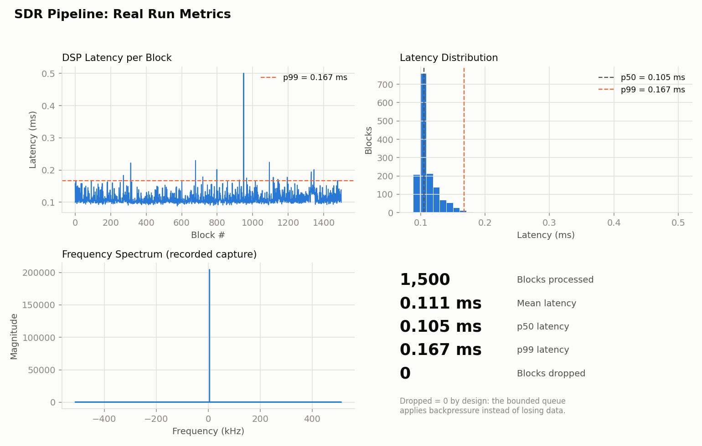
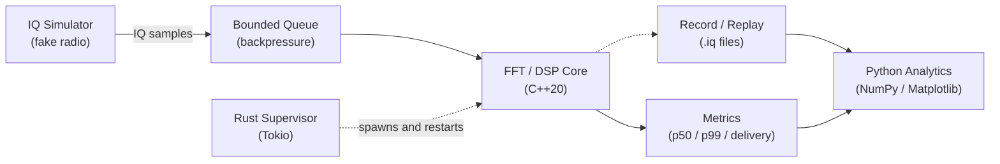

<div align="center">

# Real-Time SDR & RF Processing Platform

A multi-language, real-time signal processing pipeline: C++20 DSP core, Rust
process supervisor, and Python analytics. Simulates the data path of a
software-defined radio without requiring any physical hardware.

[](src/)
[](rust_supervisor/)
[](python/)
[](CMakeLists.txt)
[](Dockerfile)
[](LICENSE)

</div>

<p align="center">
  
</p>

<p align="center"><sub>Every number above came from an actual run of this codebase.</sub></p>

## What it does

A real SDR device, such as an RTL-SDR dongle, streams IQ samples (the raw
data behind a radio signal) at roughly one million samples per second. This
project reproduces that software data path: a producer/consumer pipeline
moves samples through a bounded, backpressured queue, runs an FFT to
extract frequency content, and measures real p50/p99 latency under load. A
Rust supervisor keeps the pipeline running, and a Python layer turns the
results into the charts above.

No hardware is required. A software simulator stands in for the radio, so
the whole system builds and runs on any machine.

## Architecture



| Layer | Role |
|---|---|
| C++20 core | Producer/consumer DSP pipeline, hand-written FFT, latency and delivery metrics |
| Rust supervisor | Async process watchdog that auto-restarts the pipeline and injects failures to prove recovery |
| Python analytics | Reads real run data and renders the dashboard above |

## Measured performance

1,500-block live run, 4096-sample blocks, 1.024 MS/s. See `assets/dashboard.png`.

| Metric | Result |
|---|---|
| Mean DSP latency | about 0.11 ms |
| p99 DSP latency | about 0.17 ms |
| Block delivery | 100%, 0 dropped (the bounded queue applies backpressure, not loss) |
| Supervisor recovery | Verified: killed mid-run and auto-restarted |

## Quick start

```bash
# Build the C++ core
mkdir build && cd build && cmake .. -DCMAKE_BUILD_TYPE=Release && cmake --build .
./sdr_platform live metrics.csv          # run and log real latency data
./sdr_platform record capture.iq         # save a reproducible test recording

# Build and run the Rust supervisor (auto-restarts the pipeline)
cd ../rust_supervisor && cargo build --release
./target/release/sdr_supervisor live

# Regenerate the dashboard from real data, or use samples/ with no build needed
pip install numpy matplotlib
python3 python/generate_report.py samples/metrics.csv samples/capture.iq
```

Or use Docker instead of local setup:

```bash
docker build -t sdr_platform .
docker run --rm sdr_platform live
```

## Project structure

```
src/                    C++20 DSP pipeline: simulator, queue, FFT, metrics, record/replay
tests/                  FFT correctness check
rust_supervisor/        Tokio-based supervisor with failure injection
python/                 Turns run data into the charts in this README
samples/                Sample run data, no build needed to regenerate charts
assets/                 Generated dashboard image
CMakeLists.txt          Build configuration
Dockerfile, flake.nix   Reproducible build environments
.github/workflows/      CI: builds the C++ and Rust code on every push
```

Each source file has a short header comment describing what it does.

## Development notes

AI assistance (Claude) was used to help develop the test suite (`tests/`)
and the Python analytics and charting scripts (`python/`). The C++ DSP
pipeline and Rust supervisor are original implementation work.

## License

MIT. See [LICENSE](LICENSE).
