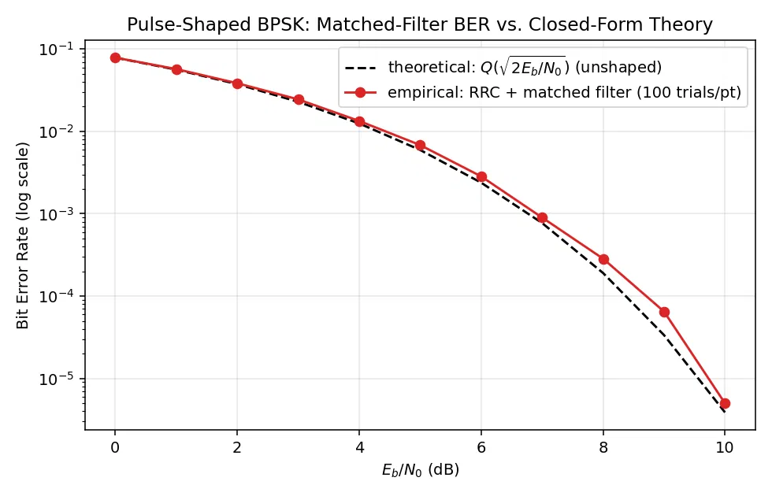
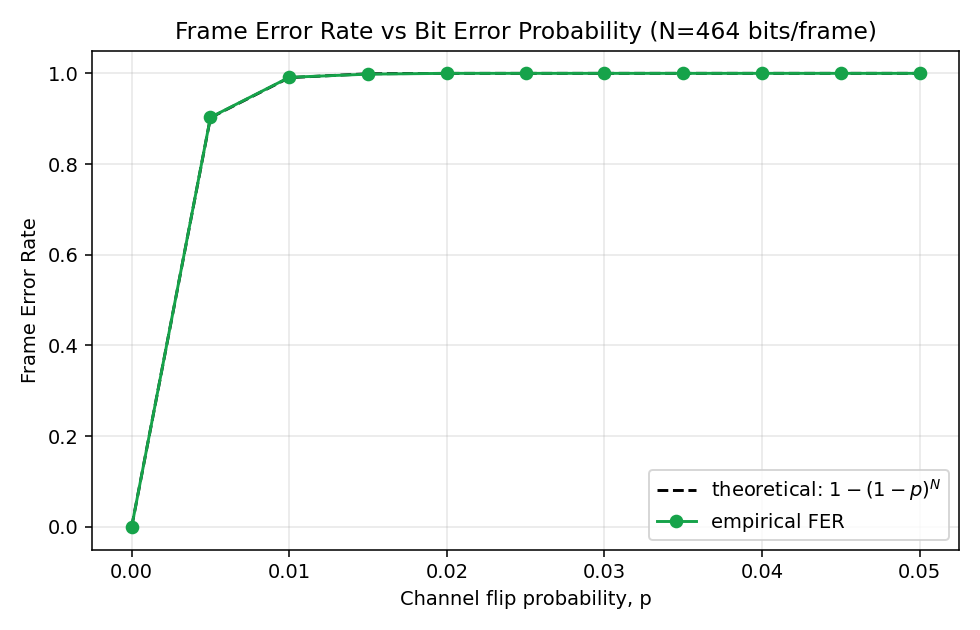
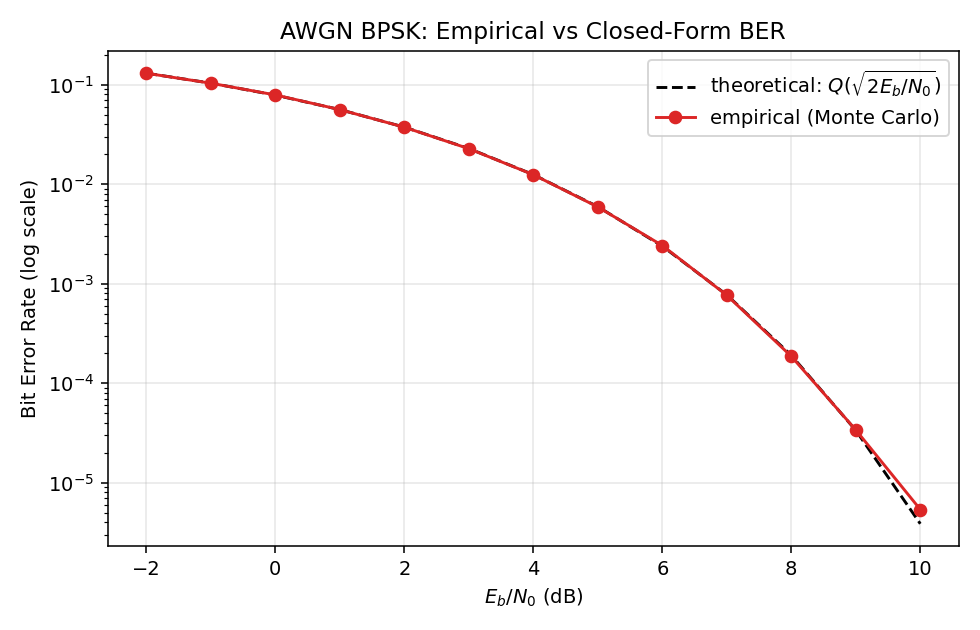

# Layered Link Simulator: From Raw Bits to a Verified Physical-Layer Waveform 

A wireless link built bottom-up: bit encoding, custom framing with CRC
error detection, two channel noise models, and BPSK with root-raised-cosine
pulse shaping, every claim checked against closed-form probability theory
via Monte Carlo simulation, not eyeballed.

Built in small versions that each work end-to-end before the next one
starts (`docs/ROADMAP.md`). Current stage: V0.4, pulse-shaped BPSK
validated through a matched filter. Next stage moves this off pure
simulation and onto real hardware: an RTL-SDR receiving a conducted
waveform generated by a Raspberry Pi Pico 2, so the BER this repo predicts
in software gets checked against an actual signal on an actual cable.

## What this demonstrates

- **Signal processing**: BPSK over a Binary Symmetric Channel and a
  proper AWGN channel, root-raised-cosine pulse shaping with a matched
  receive filter, BER verified against `Q(√(2·Eb/N0))` at every stage,
  including the small, explained gap where a finite-tap filter costs a
  little real SNR (`docs/THEORY.md`).
- **Protocol design**: a hand-built frame (header, length, sequence,
  payload, CRC) with real parsing and corruption handling, not a toy
  example (`docs/ARCHITECTURE.md`).
- **Performance analysis**: frame error rate and CRC miss-detection
  probability derived by hand, then checked against thousands of Monte
  Carlo trials per data point, discrepancies reported, not hidden.

## Quickstart

```bash
git clone <this-repo>
cd telecom-frame-sim
pip install -r requirements.txt

pytest tests/ -v                                     # 30 tests

python scripts/run_demo.py --payload "hello link layer"
python scripts/run_demo.py --payload "hello link layer" --channel flip --p-error 0.03
python scripts/run_demo.py --payload "hello link layer" --channel awgn --eb-n0-db 4

python analysis/statistical_analysis.py               # framing/CRC/channel sweeps
python analysis/pulse_shaping_analysis.py              # RRC + matched-filter BER sweep
```

## Results

Generated directly by the analysis scripts, seeded for reproducibility.
Full figure set and derivations in `docs/THEORY.md`.

### Pulse-shaped BPSK matches theory through a real matched filter

100 Monte Carlo trials per Eb/N0 point, 200,000 bits each, through the
actual transmit-shape -> AWGN -> matched-filter -> symbol-timing -> decide
chain, not a shortcut model:



### Frame error rate amplifies bit error rate fast

A frame only survives if every bit in it survives. This is the number
that justifies forward error correction next on the roadmap.



### AWGN BER reproduces the standard BPSK waterfall curve



## Repository layout

```
src/                     physical, link, and pipeline layers
  bitops.py              bit-string <-> byte conversions
  modem.py                BPSK, BSC/AWGN channels, RRC pulse shaping, closed-form BER
  crc.py                  CRC-8 compute/verify
  framing.py               frame build/parse
  pipeline.py              transmit -> channel -> receive, one call
scripts/run_demo.py        interactive CLI demo
analysis/
  statistical_analysis.py Monte Carlo sweeps: framing, CRC, channels
  pulse_shaping_analysis.py Monte Carlo sweep: RRC + matched filter BER
tests/                    30 pytest cases, one file per module
figures/, results/        generated plots and CSVs
docs/                     ARCHITECTURE.md, THEORY.md, ROADMAP.md
```

## Frame format

```
+----------+----------+------------+-------------------+---------+
| HEADER   | LENGTH   | SEQUENCE   | PAYLOAD (N*8 bits) | CRC-8   |
| 8 bits   | 8 bits   | 8 bits     | LENGTH*8 bits      | 8 bits  |
+----------+----------+------------+-------------------+---------+
```

CRC-8 (`0x07`) computed over `HEADER || LENGTH || SEQUENCE || PAYLOAD`,
exactly what's on the wire. Layer breakdown in `docs/ARCHITECTURE.md`.

## Testing

```bash
pytest tests/ -v
```

30 tests: bit-string round-tripping, CRC determinism and corruption
sensitivity, frame build/parse and corruption detection, RRC filter
symmetry/energy/no-NaN checks across rolloff and oversampling ratio, and
matched-filter sign recovery.

## Roadmap

Next: rate-1/2 convolutional coding with soft-decision Viterbi decoding,
then the full simulated receiver DSP chain (sync, downconversion, decimation),
then hardware bring-up on a Pi Zero 2 W + RTL-SDR pair, with the Pico 2
generating the conducted test waveform. Full ladder and reasoning in
`docs/ROADMAP.md`.

## License

MIT, see `LICENSE`.
